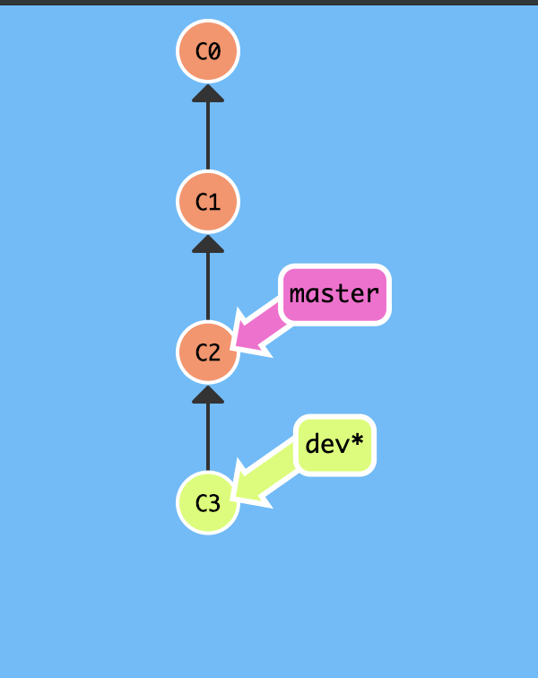
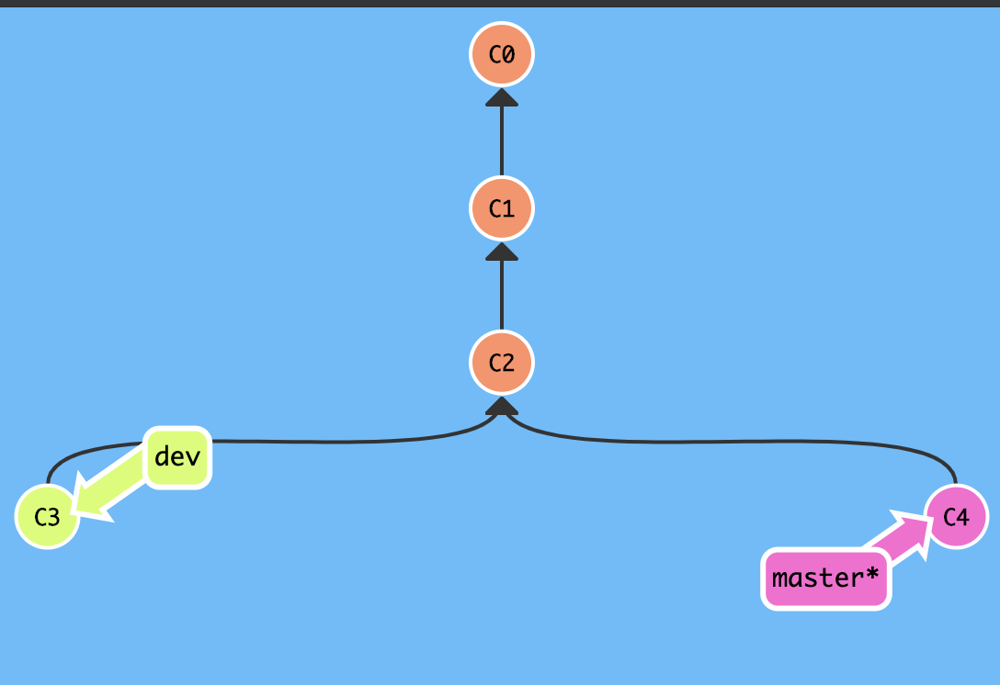
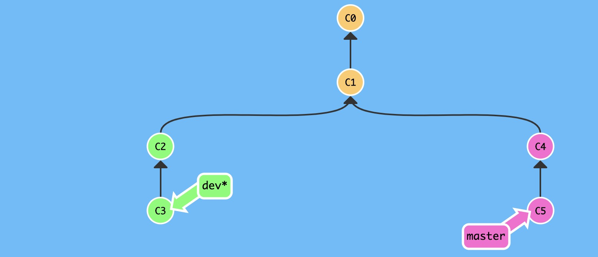
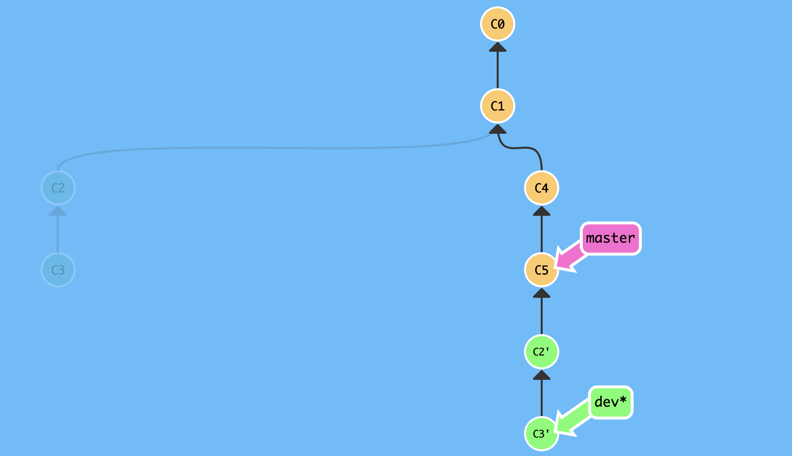
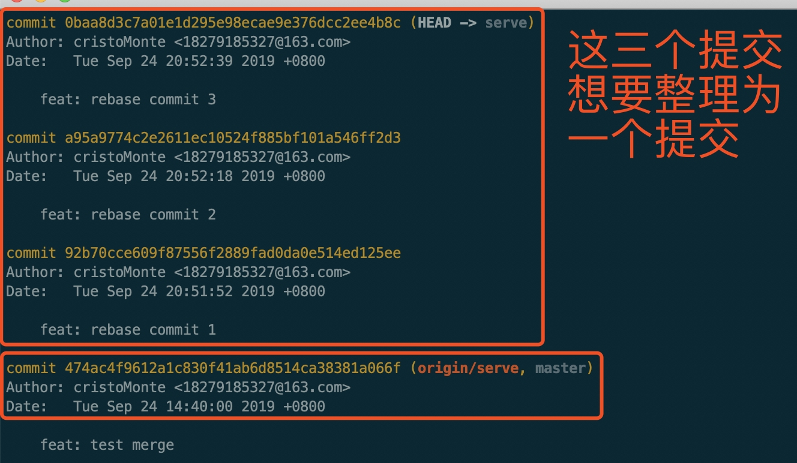
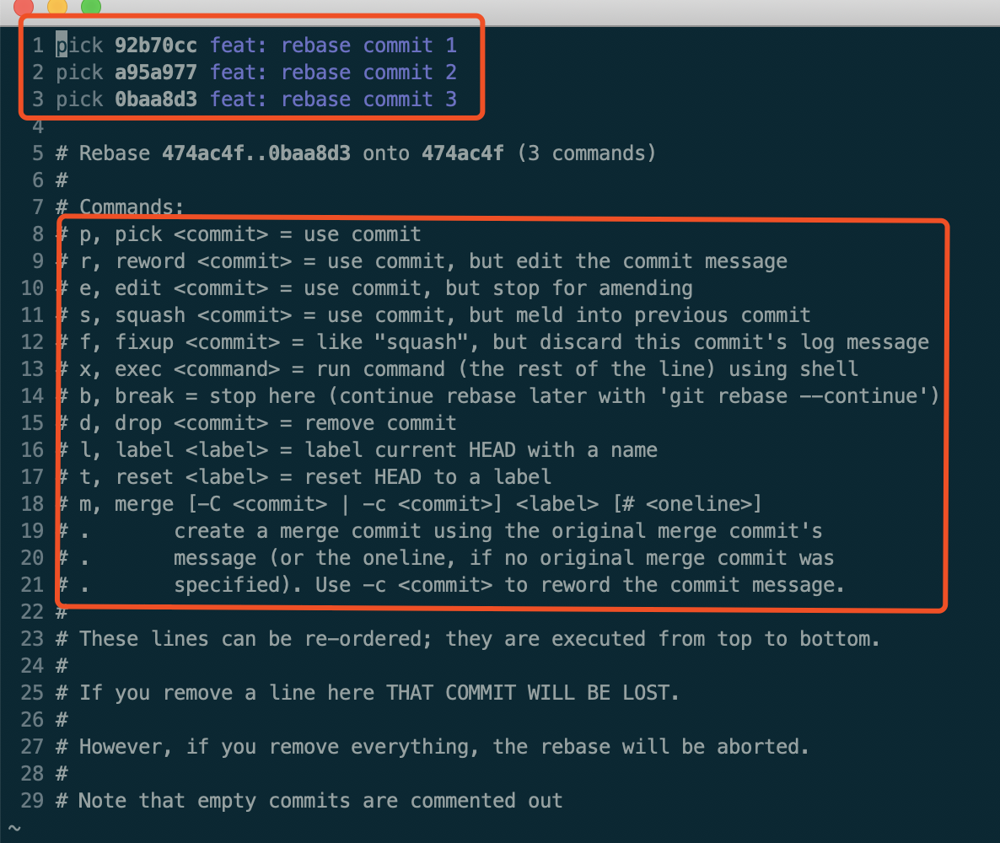
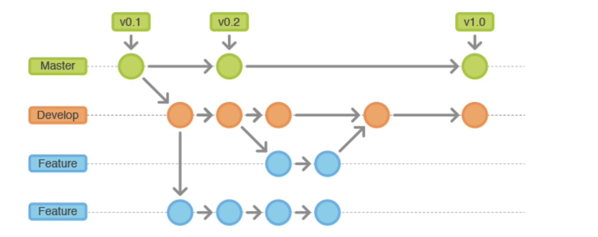
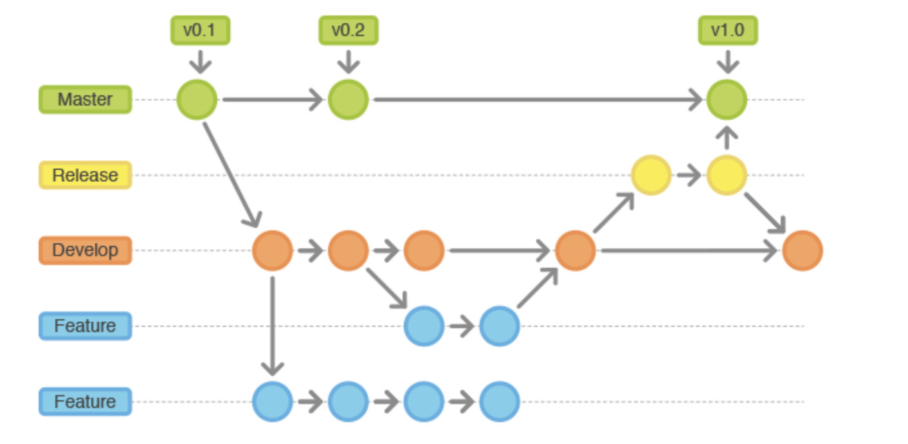
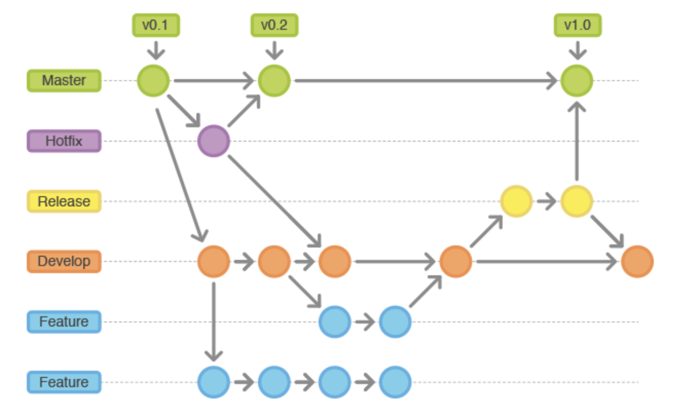

## 什么是Git

- 被最广泛应用的现代软件管理系统
- github上成熟且活跃的开源社区
- 分布式架构
- 支持绝大多数的操作系统和IDE

### 对分布式架构的理解


- 分布式和集中式，典型代表Git/SVN
- 集中式，中心化的系统，有一个中心服务器，所有的操作都要基于中心服务器，一旦服务器挂了，或者没网了，开发者就没有办法提交
- 分布式，去中心化，每个人都有又一个完整的库，就是我们的本地仓库，在离线情况下，仍然可以进行提交。
- 虽然我们平时的工作流程是，每个人的本地仓库提交之后推送到远程仓库，远程仓库看起来好像是一个中心，但其实远程仓库也不过是一个用户而已，实际上你也可以pull张三的库，push给李四等等。


##  git相关的基本概念

- 工作区（Working Directory/ work tree）&& 暂存区(stage)/索引(index)    版本库 && 远程仓库

- 工作区就是你的工作目录

- 版本库，当你执行了`git init`命令之后，会产生一个隐藏文件，`.git`，这个就是版本库,下面是`.git`的目录

```jsx{3,7,8,11,12}
-rw-r--r--    1  staff     9B Aug  8 17:21 COMMIT_EDITMSG
-rw-r--r--    1  staff    89B Aug  9 10:23 FETCH_HEAD
-rw-r--r--    1  staff    23B Aug  9 10:01 HEAD
-rw-r--r--    1  staff    41B Aug  8 17:21 ORIG_HEAD
-rw-r--r--    1  staff   361B May 29 18:28 config
-rw-r--r--    1  staff    73B May 29 18:26 description
drwxr-xr-x   13  staff   416B May 29 18:26 hooks
-rw-r--r--    1  staff    19K Aug  8 17:21 index
drwxr-xr-x    3  staff    96B May 29 18:26 info
drwxr-xr-x    4  staff   128B May 29 18:27 logs
drwxr-xr-x  150  staff   4.7K Aug  8 17:21 objects
drwxr-xr-x    5  staff   160B May 29 18:28 refs
```

- `index`就是暂存区，是Git中的重要概念，当对工作区修改/新增文件执行git add 命令之后，就会产生一个新纪录存入暂存区中。

- `HEAD`是一个游标，当我们创建版本库的时候，git会主动为我们传创建一个分支，master, 此时HEAD指向master最近的一个提交,如果你切换到dev分支了，那么HEAD指向的就是dev分支最近的一个提交。

- `ORIG_HEAD`保存的也是提交记录的sha1，当执行一些风险操作的时候，比如rebase，reset或merge的时候，Git会将原来HEAD执行的commit保存在ORIG_HEAD中。

- `hooks`，顾名思义，钩子，里面存放了多种钩子文件，都是.sample后缀，是示例文件，不生效，去掉.sample后缀才生效，比如pre-commit.sample文件，这个钩子在执行`git commit`之前被调用，我们在项目中使用的husky+lint-staged就是改了这个钩子文件来实现提交前的校验。

- `COMMIT_EDITMSG`存放了你最近一个提交的提交信息

- `refs`保存了各个本地分支和远程分支以及tags当前所指向的提交，HEAD和refs的关系： HEAD -> refs/heads/branchName -> commit
    ```jsx
    drwxr-xr-x  8  staff   256B Sep 20 10:06 heads
    drwxr-xr-x  3  staff    96B Dec 29  2018 remotes
    -rw-r--r--  1  staff    41B Sep 11 13:17 stash
    drwxr-xr-x  4  staff   128B Sep 10 21:50 tags

    heads,remote,tags这三个文件夹是一定存在，存放各个分支和tags指向的提交，保存的都是提交的sha1
    stash是当你执行了git stash暂存之后生成的一个文件，将当前最前面的stash记录生成一个sha1写进这里面
    ```

- `objects` 存放了所有的git对象，有兴趣了解更多关于Objects的东西，可以点[这里](https://zhaohuabing.com/post/2019-01-21-git/)


## git常用命令

`git init` , `git clone` , `git add`, `git commit`, `git pull`, `git push`, `git status`

`git merge`, `git rebase`, `git reset`, `git revert`, `git cherry-pick`

### git init
生成一个git版本库，在当前目录下生成一个隐藏文件.git

### git clone

创建一个本地仓库的克隆版本
```jsx
git clone path/to/repository
```
从远端服务器上克隆一个版本库
```jsx
git clone username@host:/path/to/repository
```


### git add
Add file contents to the index,将指定文件添加到暂存区
添加指定文件
```jsx
git add path/to/file
```
批量添加文件
```jsx
// . 表示当前目录， 这个命令代表将当前目录下所有工作区的改动添加到暂存中
git add .

// -A 表示--all 添加工作区下所有的改动，不仅仅是当前目录下。
git add -A

```

### git commit
将所有暂存区的内容生成一个commit提交记录保存到本地版本库中
```jsx
git commit -m "commit message"
// 修改最近一次提交的提交信息
git commit --amend 
```

### git pull
- Fetch from and integrate with another repository or a local branch，从另一个仓库或者本地分支获取并与之集成。
`git pull`其实是一个简写，是git fetch 和git merge FETCH_HEAD这两个命令的简写。

- 完整用法 
```jsx
git pull [options] [<repository> [<refspec>]]
```
- 使用

```jsx
git pull origin dev:dev

// 这条命令是下面这两条命令的简写
git fetch origin
git merge orign/dev

// 本地分支可以省略, pull的默认行为就是merge到你当前所在的分支
git pull origin dev

// 当前dev分支与origin/dev分支建立了追踪关系，所以远程分支名也可以省略
git pull origin

// 当前版本库只存在一个fetch url，远程名也可以省略
git pull
```

 `git pull --rebase`使用git rebase来代替git merge，至于为什么要使用rebase来代替merge，接下里会详细的讲明。

```jsx
git pull --rebase origin dev

// 这条命令等同于执行下面两条命令

git fetch origin
git rebase orgin/dev

```

### git push
Updates remote refs using local refs，将本地提交推送到远程仓库

- 完整使用
```jsx
git push [<repository> [<refspec>...]]
```
- 其他

```jsx
// -u 是--set-upstream的简写，表示origin/master分支和local/master分支建立追踪关系，此后使用git push就是采用这种默认方式推送到origin/master分支上
git push -u origin master

//省略了远程分支名, 表示将本地分支推送到与之存在追踪关系的远程分支，通常是一个同名的分支， 如果远程没有该分支就会被创建
git push origin master

// 二者之间的区别是，-u将远程分支和本地分支建立了追踪关系，之后的推送无需指定repository和远程分支，反之不会建立追踪，下一次推送仍然要指定远程

// 删除origin/dev分支
git push origin :dev

// 和下面这个命令是等价的
git push origin -d dev

// 在多人写协作开发下，如果其中一个小伙伴删除了远程的某个分支，是不会主动推送给其他的用户，所以其他用户需要手动检查更新
git remote prune orgin
// 或者
git fetch --prune
// 上面两条命令都能达到更新远程分支的效果，不同的是git fetch --prune在更新远程分支之后会fetch当前分支最新的代码。
```

### git status
- 查看工作区的状态，这个命令可以看作是一种智能提示，因为这个命令不仅会显示working tree当前的状态，同时还会提示你下一步可能的操作。

#### git merge VS git rebase

##### git merge
- git merge 是通过合并其他分支的histories来达到当前分支往前走的目的
- git merge 有fast-forward和no-fast-forward两种默认方式进行合并，git会根据不同的情况采用不同的默认方式进行合并

这种情况下master分支相对于dev分支，只是简单的落后于dev分支，在dev分支前进的时间里，master分支没有产生其他的commit, 此时执行`git merge dev`是采用fast-forward,直接快进，不会产生一个新的commit节点


此时在master分支相对于dev分支，不仅仅是简单的落后于dev分支，在dev分支前进的同时master分支也在前进，此时执行`git merge dev`就会产生一个新的commit节点来记录这一次的merge。


值得注意的是，在fast-forword默认模式下，你可以使用--no-ff(no fast forward)来阻止快速合并，强制生成一条合并commit记录此次合并，但是在no-fast-forward默认模式下，不能强制更改为fast-forward合并。只能使用别的当时去合并，这便是下面要说的，rebase,变基。

##### git rebase
- git rebase通过变基的方式,改变当前分支的初始commit,然后在新的base上一个一个地运行这个分支上的所有commits。



例如上面这种情况，可能因为你的同事在master上改了bug，或者开发了新的功能上传到了master，你开发的功能依赖你同事开发的部分，所以这时候你需要让代码合并起来，如果此时使用merge的话，一定会产生一条merge树，这样非常丑，所以你可以这样操作
```jsx
git checkout master
git pull
git checkout dev
git rebase master
```
执行上面的命令之后，产生的效果如下图

dev分支本来是从commit C1这个节点上创建出来的分支，执行了git rebase master之后就变成了从commit C5节点上创建出来的分支，这就是变基的含义， 然后在将原本在dev上的两个提交C2和C3一个一个的运行在新的dev分支上。

##### 那到底什么时候用git merge, 什么时候用git rebase呢？
- 使用merge合并分支，希望在git中留下当前local分支存在过的记录，即使以后那个分支删除了，还是能在git提交记录中找到那个分支开始和结束时间。
- 使用rebase整理分支，是不希望当前的local分支出现在提交树中，它并不具备有特殊的意义，自然也不需要留下痕迹，更不应该把提交树的提交搞得混乱不堪。
##### 所以总结来说就是下面几点
- rebase 黄金定律
```
永远不要rebase一个已经分享的分支到非remote分支
比如rebase到master,develop,release分支上)
也就是说永远不要rebase一个已经在中央库中存在的分支.
只能rebase你自己使用的私有分支
```
- 当前local分支存在具有特殊意义，比如说是需要展现一个功能开发过程的feature分支，或者是体现一个bug修复过程的bugfix分支，这些分支都应该体现在提交树中，因为它能完整的体现一段业务实现的过程，所以这些情况下，应该使用`git merge localBranchName --no-ff`。使用--no-ff来确保一定会生成一个merge commit，因为如果你要合并的分支在localBranch创建之后没有更改，那么git在merge的时候会采用fast-forward模式，这种模式不会产生merge commit，这样就达不到目的了，所以必须加上这个参数去确保merge commit的产生。

- local branch的存在仅仅是为了开发的同时保持master分支（这里举例为master,实际上可能是其他你将要合并的分支）的稳定，不存在其他特殊的意思，那么此时应该使用git rebase + merge来达到一个fast-forward 合并。具体操作如下
```jsx
// 如果此时master分支从local branch创建之后没有新的提交，那可以直接merge
git checkout master
git merge localBranchName
// 如果master分支从local branch创建之后有产生了新的提交，那么local branch 需要先使用rebase来确保merge的时候采用fast-forward模式
git rebase master
git checkout master
git merge localBranchName
// 这里为什么不直接在master分支上rebase，因为master分支上的提交已经在中央仓库中已经存在了，rebase会重写历史记录，这对于已经push完成的记录是不合理的。这样做也不符合之前说的rebase黄金定律
```
- 在使用`git pull`命令的时候，应该使用`git pull --rebase`来代替。pull命令是fetch和merge两条命令的简写，使用--rebase是使用`git rebase`来代替`git merge`。例如，在dev分支，你commit了一些提交，这时候你的同事在dev分支上push了一写commit，这是经常出现的场景，此时如果你直接push的话git会禁止你的push操作，它会提示你先pull再进行push操作，所以这时候需要执行`git pull`。那么和普通的merge操作一样，当origin/dev和你本地的dev分支进行merge的时候肯定会产生一条merge commit，并且留下一条不必要的树在git记录中。但是这条merge记录是毫无意义的，甚至是多余的，只会让提交树变得难以辨别。而使用rebase的话，将会重写整个histories，不会残留不必要的记录，污染历史图谱，而且这个过程并不会和之前我们说的rebase黄金定律相矛盾。

##### git rebase的其他作用
- 想象一下下面这些场景：
```
1 我们在不同的分支上切换，开发，导致产生了一些不连续非必要的commit.
2 我们可能需要一些连续的commit才完成一个bug的修复
```
- 如果我们都将上面这些commit全部push到远程仓库，会导致一个混乱的history产生，长期如此，history tree将混乱不堪，难以阅读，更难以被他人重用。
- 所以我们在push commit之前，先使用rebase来将我们的本地分支整理一下,过程如下图


```jsx
// -i --interactive 列出将要生成新的提交的commit lists
// 474ac4f9612a1c830f41ab6d8514ca38381a066f是最后一个需要被整理的commit前一个commit的sha1
git rebase -i 474ac4f9612a1c830f41ab6d8514ca38381a066f
// 后面不带commit sha1的话表示将当前index中所有commit列举出来
git rebase -i
```
- 执行完这个命令之后你会看到下面这个界面

这是一个可编辑的界面，在这个界面你可以修改commit提交信息，整合commit等等。值得注意的是这里的commit排序是倒叙，最下面那个commit才是最后一条提交；如果要使用squash将提交整合，squash的commit前面必须保留至少一个commit。

### git reset

- `git reset`将HEAD重置到某个特地的状态

- `git reset`主要使用的有soft， mixed， hard三个模式，这三个模式区别之处在于影响的范围不一样

```jsx
// 索引和工作区都不会被改变
git reset --sort commit/HEAD~4(表示当前HEAD前4个commit)
// 索引改变，工作区回到暂存之前的状态，这种也是git的默认方式
git reset --mixed commit/HEAD~4
// 索引和工作区都会回到给定提交的状态，新增的文件会被删除，被删除的文件还原
git reset --hard commit/HEAD~4
```
- git reset是相对危险的命令，尤其是hard模式，当然这些更新都将只是针对local branch。如果这些还原要同步到origin， 在没有改动到origin commit的前提下，直接push，但是在reset了origin commit的情况下，需要使用`git push -f(--force)`来执行推送。 `git reset --hard`和`git push -f`是极其危险的操作，一旦重置，原来的记录就找不回，所以不推荐在开发过程中使用。

### git revert
回到一个给定提交之前的状态，并产生一个新的提交来记录这个操作

- `git revert commit`

- `git reset`是让HEAD往后退，它改写了history, `git revert`是让HEAD往前走，生成一个新的commit来记录这一次的反转，相对而言，reset更加危险。

### git cherry-pick
从其他分支的挑选出你需要的commits， 移植到当前分支，产生一个新的commit来进行提交.
```jsx
// 将你需要的commit的sha1写在命令后面，这样你所选择的那些commit就会出现在当前的分支上，当然，commit记录不会出现在这个branch tree上，但是会产生一个新的commit来进行提交
git cherry-pick [commidSha1, [commidSha1...]]
// 你也可以选择一个commit区间，它的范围就是 startCommidSha1 到 endCommidSha1 之间所有的commit，但是它这是一个 (左开，右闭] 的区间，也就是说，它将不会包含 startCommidSha1 的 commit。
git cherry_pick <startCommidSha1>…<endCommidSha1>
// 如果想要包含 startCommidSha1 的话，就需要使用 ^ 标记一下，就会变成一个 [左闭，右闭] 的区间
git cherry-pick <startCommidSha1>^...<endCommidSha1>
```

## Gitflow work
Gitflow工作流是经典模型，是工作流的经验和精髓。尤其是当项目复杂化，就越能感受到这个工作流的智慧和魅力。

### 集中式工作流
- 这个是参考SVN产生的一个工作模型，线上只维护一个分支，就是主分支master，所以的开发者都基于这个分支进行commit, push

- 这种模式的好处就是，完全照搬了SVN工作模式，SVN用户不需要额外学习git就能上手。但是这完全没有使用git分布式协作的优点，所以这种方式极少采用。

### 功能分支工作流
- master-featrue模型，这个模型在集中式的基础上给妹个新功能开发建立一个专门的分支，这样既隔离了多个开发者的功能开发，不会弄乱代码，又保证了开发期间master分支的稳定性，但同时这种方式也具有足够的灵活性。

- 功能开发隔离让pull requests工作流成为可能，每一个功能完成要合并到master前都需要提交pull request，团队伙伴review之后再选择是否merge

- featrue分支是否推送到中央仓库都可以，由于master是仅有的一个「特殊」分支，在中央仓库上存多个功能分支不会有任何问题

### Gitflow 工作流
- Gitflow工作流是管理功能开发、发布准备和维护的常用模式。相对于其他两种模型，Gitflow相对复杂和繁琐，但是对于大型复杂项目，这种模式往往是最合理的。

- Gitflow模型是master-develop-release， master仍然作为主分支，develop作为开发分支，release承担着预发布的责任。这种模型下，master和dev都是需要长期维护的分支，release、hotfix、featrue这三种分支都是短期分支，发布结束，bug修复结束，功能开发结束便会删除。

#### 功能开发

功能开发过程类似功能分支工作流模型，每一个新功能都用一个新的featrue分支开发，但是不同的是，featrue不是从master上创建的，而是从dev分支上创建。feature从来不会和master分支交互。功能分支上的功能开发完成之后合并到dev分支



#### 发布测试
- 一旦dev分支上拥有了一次发布所需要的所有功能，就从dev分支上创建一个release发布分支，来完成之后的发布流程。这个release不会再合并新的功能，它只做bug修复，文档生成以及其他面向发布任务的事情。直到测试完成，发布工作全部完成之后，打好tag， 合并到master分支，完成上线。

- 完成发布之后，release分支自创建依赖产生了一些commit，需要合并回dev分支。

- 这个发布分支的存在让发布流程和其他新功能开发流程可以同时进行，相互不受影响。



#### 维护分支

- 维护分支，hotfix分支就是上线之后用于上线后给产品快速打补丁，hotfix也是唯一从master主分支创建出来的分支,它测试完成之后需要合并到master和dev分支， master分支上要打好tag重新发布。



### 参考资料
[git rebase vs git merge](https://www.cnblogs.com/kidsitcn/p/5339382.html)

[git高质量中文教程](https://github.com/geeeeeeeeek/git-recipes)

[git tips](https://github.com/521xueweihan/git-tips#展示帮助信息)

[git work flow](https://github.com/oldratlee/translations/blob/master/git-workflows-and-tutorials/README.md)

