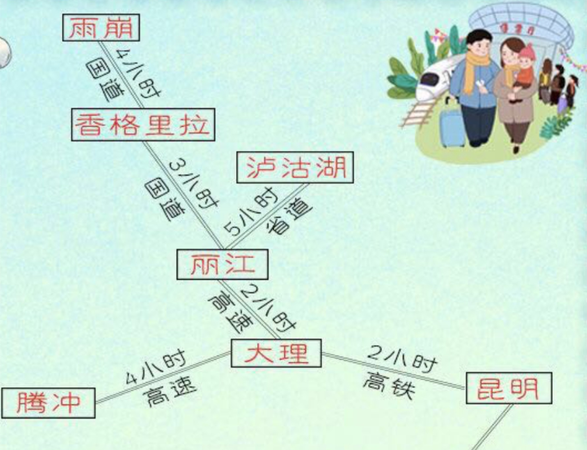
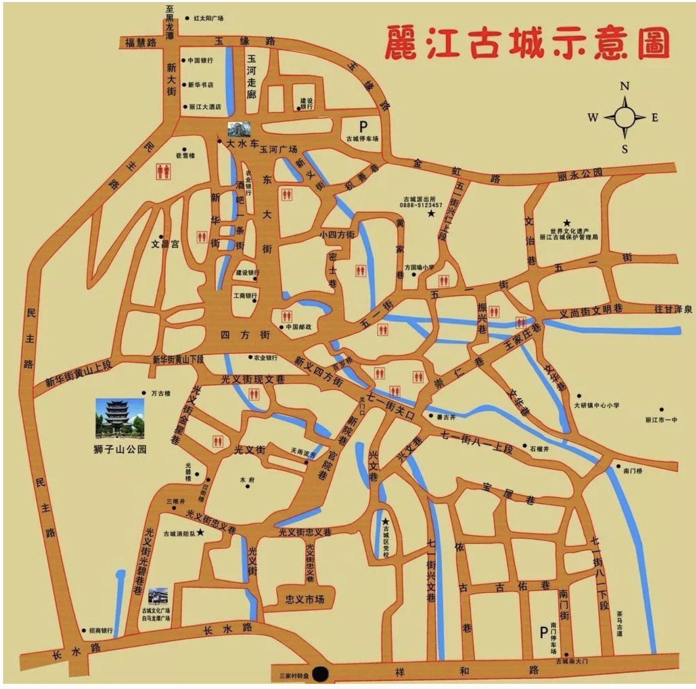
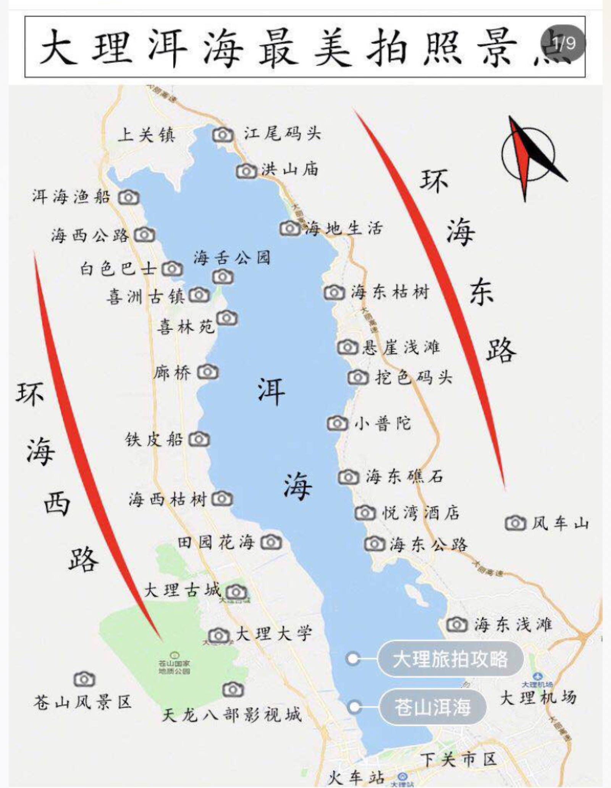

## 时间

2019年7月5日-2019年7月10日

## 天气

紫外线很强，防晒 防晒 防晒 重要的事情说三遍

气温不算很高20-30度。

6-8月是云南的雨季，早晚也有一定的温差，所以要带个外套，带一套休闲服，我们需要上雪山。

## 必带的物品

- 防晒霜，防晒衣，墨镜，阳伞，遮阳帽等一切你拥有的防晒用品（但是喷雾式的防晒尽量不要带，上不了飞机会比较麻烦）不然回来就是黑炭一颗

- 各种证件，身份证，有学生证的请带学生证，驾驶证。

- 衣服：红的黄的白的你拥有的最好看的裙子都带上，休闲的带一两套，毕竟要去雪山和苍山

- 洗簌用品，洗发水，沐浴露，洗面奶，水乳，面霜，尽量带旅行装，超过100ml的液体不让上飞机

- 杯子，用来旅途装水喝，当然你觉得麻烦的话就不带也行。

## 路线
😊丽江(2天)

😊大理(2天或者3天)

😊昆明(1天或者0天)




## 游玩计划

#### 丽江 （大研古城 + 玉龙雪山）

😯Day 1 (7月6号) 大研古城

古城维护费80/人



- 酒店

大部分民宿住3晚都提供接机服务

```jsx{3}
// 听花堂（丽江无双店）,网红酒店，很多花，适合拍照，可能要定一个家庭房，参考价格714

// 一念花开，278，步行至大水车5分钟，环境看起来很nice，一房两床可住3人，携程上丽江民宿排行榜的第一名，评分5.0

// 品茶聊天，188，3床，评分5.0
```

- 大研古城

```jsx{3}
景点：

// 大水车 -> 四方街 -> 五一街

// 狮子山和万古楼可以鸟瞰整个丽江古城，不同的是狮子山免费，万古楼要加收50/人的门票费

// 忠义市场可以感受到真正的纳西族生活，很多当地人会来这里购买东西

美食：

// 勺子米线，需要排队，米线肯定是必吃的，在四方街内，新义街百岁坊8号

// 丽江粑粑，名小吃来的

// 包浆豆腐，那个上过舌尖上的中国的豆腐。

// 还有鲜花饼啊，炒酸奶之类的小吃到时候可以边逛边吃。
```


- 束河古城

```js{5}
// 从大研古城打车去束河古城,单程20-30元

// 束河古城除80元/人的古城维护费之后要加收60元/人的门票，但是一般不会查自助旅行的游客

// 飞花触水，位于古镇的飞花路中心地带。

// 束河四方街，旁边有横跨青龙河的大石桥，据说是丽江境内最大最古老的石拱桥
```

- 以上景点只是参考，不一定要一天之内全部去，可以选择一些，反正慢慢走，能玩多少玩多少，主要是感受一下古城和纳西族独特的生活方式。

😯Day 2(7月7号) 玉龙雪山

```jsx
// 可能会有高反，可以提前吃点药。

// 玉龙雪山需要比较好的天气,下暴雨估计去不了

// 准备报个一日游的团，一般是300～500/人，包含午餐，寒衣+氧气瓶+矿泉水，很方便。下午4:30返回市区。

// 晚上要是还有精力，可以再去街上逛一逛。
```

#### 大理（洱海 + 苍山 + 三塔）

> 苍山不墨千秋画，洱海无弦万古琴

- 洱海 + 大理古城

😯Day 3(7月8号) 洱海环海


``` 
// 早上7点左右从丽江出发，10点左右到大理

// 从海东出发，到海西，反正就是沿着洱海一路开一路拍
```

- 酒店

```jsx
8号晚住海景房，9号晚住大理古城民宿，方便一点

海景房

// 大理木兮（这个酒店快被定完了，要住需要尽快）600 - 800/ 晚，可以加床，加一张床需要200元，在海东，正好是洱海海东的尽头方向。

// 大理远山青海景民宿 1214/晚 可住3人,也在海东，洱海尽头方向

民宿

// 民宿的选择很多，到时候再看看
```

😯Day 4(7月9号) 苍山 + 崇圣寺三塔

- 苍山
``` jsx
// 虽然是夏季，但是山上可能还是有点冷，不过在山顶可以租衣服，如果很冷的话，50-60/件，押金300.
// 因为海拔有4000米，可能会出现高反，可以在进入索道前买个氧气瓶。
// 洗马潭索道全票是280/人，洗马潭往返+影视城+苍山地质公园
// 门票不要定太早，可能会因为天气原因，根本就上不去
```
- 崇圣寺三塔

  ```jsx
  // 门票75/人

  // 从苍山下来开车30分钟左右到

  // 然后回酒店，晚上可以在大理古城逛一逛
  ```
  
😯Day 5(7月10号) 可以在酒店休息一下，然后出发去昆明

```jsx
// 大理到昆明的动车2个小时

// 昆明站到长水机场要1个小时

// 晚上7点的飞机，所以在下午四点前要到达昆明站
```


